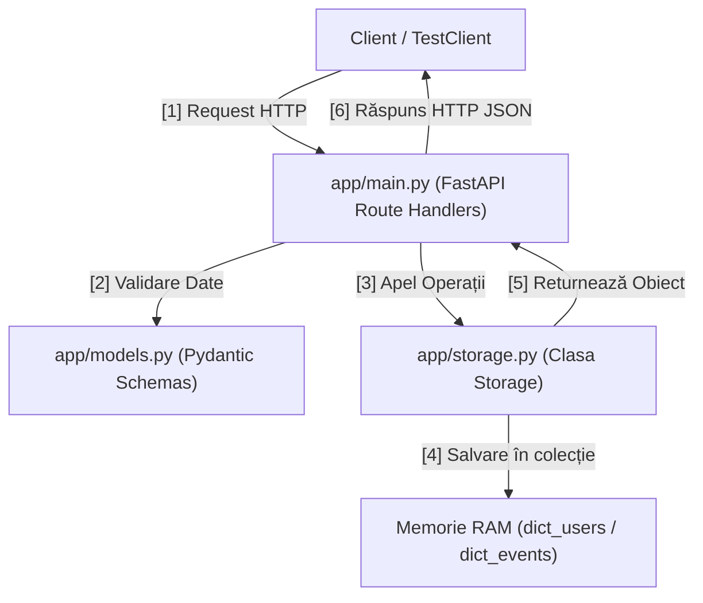
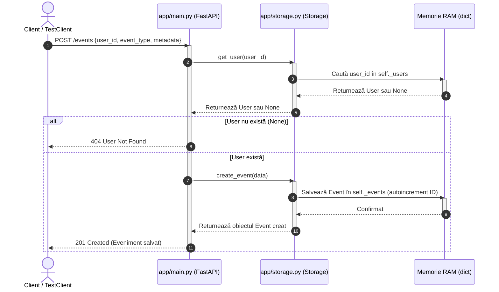

# Arhitectura Proiectului 🏗️

Pentru a înțelege cum funcționează aplicația, trebuie să aruncăm o privire la modul în care sunt structurate fișierele și cum comunică ele între ele. Codul este simplu, structurat modular conform standardelor din industrie.

---

## 📁 Structura Fișierelor

Proiectul este organizat astfel:

```text
task-internship/
├── app/                  # Codul sursă al aplicației
│   ├── __init__.py       # Inițializarea pachetului Python
│   ├── main.py           # Endpoint-urile API și configurarea FastAPI
│   ├── models.py         # Schemele de date Pydantic
│   └── storage.py        # Stocarea in-memory (baza de date simulată)
├── tests/                # Testele automate
│   ├── __init__.py
│   └── test_app.py       # Fișierul cu toate testele noastre unitare
├── pyproject.toml        # Configurația proiectului și a dependențelor
└── README.md             # Documentația primită cu instrucțiuni
```

---

## 🗺️ Diagrama Componentelor & Ciclul de Viață al unui Request

Iată cum circulă un request trimis de un client (de exemplu, din Swagger sau din teste) prin componentele aplicației:



---

## 🧱 Componentele Principale

### 1. Ruterul API — `app/main.py`
Aici se definește instanța aplicației FastAPI (`app = FastAPI(...)`) și rutele (endpoint-urile):
* `GET /health` - Verificarea stării aplicației.
* `POST /users` - Înregistrarea unui utilizator nou.
* `GET /users/{user_id}` - Preluarea datelor unui utilizator.
* `POST /events` - Adăugarea unui eveniment nou în sistem.
* `GET /events` - Listarea tuturor evenimentelor active (cu paginare).
* `DELETE /events/{event_id}` - Ștergerea logică (soft-delete) a unui eveniment.

### 2. Schemele de Date — `app/models.py`
Folosește **Pydantic** pentru a se asigura că toate datele intrate sau ieșite respectă tipurile de date specificate.
* **Clasele `Create`** (e.g., `UserCreate`, `EventCreate`) nu conțin ID-uri sau timestamp-uri generate automat (sunt folosite pentru input).
* **Clasele Complete** (e.g., `User`, `Event`) reprezintă structura stocată în "baza de date" (conțin `id` și `created_at`).

### 3. Stocarea de Date — `app/storage.py`
În mod normal, un proiect real folosește o bază de date (PostgreSQL, MySQL). Pentru simplitatea task-ului, folosim clasa `Storage` care stochează totul în memorie, în două dicționare:
* `self._users: dict[int, User]`
* `self._events: dict[int, Event]`
* ID-urile sunt autogenerate prin incrementare simplă (`_next_user_id`, `_next_event_id`).

---

## 🔄 Diagramă de Secvențe (Sequence Diagram)

Această diagramă arată interacțiunea dinamică și ordinea apelurilor de metode în timp ce se înregistrează un eveniment (POST `/events`):



---

> [!TIP]
> **Pasul următor:** Mergi la **[[Happy-Flow|Fluxul Principal (Happy Flow)]]** pentru a vedea codul specific și logica din spatele creării utilizatorilor și evenimentelor.
